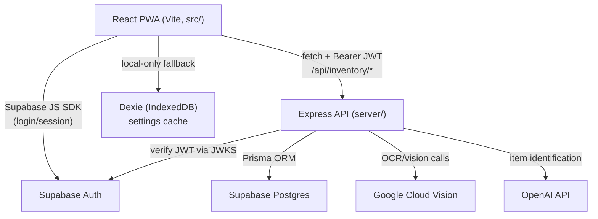

# StowAway (seamed-safe-haven) — Architecture Notes

Personal reference notes. Not committed (see .gitignore).

A PWA inventory-tracking app ("StowAway Safe Haven") with a React SPA frontend and a
small Express API, backed by Supabase (Postgres + Auth) via Prisma.

## High-level

## Frontend (src/, Vite + React 19)

- **Routing**: App.tsx defines routes with react-router-dom; every page is
  React.lazy-loaded behind a single Suspense (keeps login screen from pulling in
  tesseract/exceljs/jspdf/zxing).
- **Auth gate**: src/components/ProtectedRoute.tsx wraps authenticated routes;
  src/context/AuthContext.tsx wraps @supabase/supabase-js for session/sign-in/sign-up/
  magic-link, with a VITE_MOCK_AUTH dev-bypass mode.
- **Data layer**: src/context/InventoryContext.tsx + src/lib/database.ts — a thin
  fetch client that calls the Express API at /api/inventory with an
  `Authorization: Bearer <supabase JWT>` header (or `Bearer dev-token` locally).
  Dexie (IndexedDB) is used only as a small local fallback store, not the primary
  datastore.
- **UI**: mix of MUI (theme.ts, @mui/material) and shadcn/Radix primitives
  (src/components/ui), Tailwind for styling. Feature folders: dashboard/, inventory/,
  labels/ (barcode/PDF label generation via jsbarcode/jspdf), scanner/ (camera
  capture + ZXing barcode decode + object/vision identify flow), layout/ (AppShell).
- **PWA**: vite-plugin-pwa for manifest/service worker/offline installability.
- **Config**: src/config/supabase.ts builds the Supabase client from
  VITE_SUPABASE_URL/VITE_SUPABASE_ANON_KEY; src/config/featureFlags.ts for flag
  toggles.

## Backend (server/, Express + TypeScript)

- **Entry**: server/src/index.ts — Express app, CORS, JSON body parsing (12MB limit
  for image payloads), mounts /api/inventory, plus /health.
- **Auth middleware**: server/src/middleware/auth.ts verifies Supabase-issued JWTs
  via remote JWKS (jose), sets req.userId; has a dev-bypass path (x-dev-user-id +
  Bearer dev-token) that auto-seeds a local dev user/settings row via Prisma.
- **Routes**: server/src/routes/inventory.ts — CRUD for inventory items
  (GET/POST /, PUT/DELETE /:id), plus vision endpoints:
  - POST /vision/ocr — server-side OCR (Google Cloud Vision) instead of
    client-side Tesseract.
  - POST /vision/identify — item identification from a photo, calling out to
    OpenAI, keeping the key server-side.
- **DB access**: Prisma client (server/src/lib/prisma) against schema.prisma
  (production, Postgres/Supabase) or schema.local.prisma (SQLite, local dev only) —
  models User, InventoryItem, AppSettings, all scoped by userId.

## Data model (Prisma)

- User (id = Supabase auth user id) 1—many InventoryItem, 1—1 AppSettings.
- InventoryItem covers medical/supply metadata (category, vessel, strength,
  expiration, location, barcode, photos-as-JSON).
- AppSettings holds per-user thresholds/theme/role/subscription tier.

## Auth flow

1. Supabase Auth handles sign-up/sign-in/magic-link in the browser (AuthContext).
2. Client attaches the Supabase access token as a Bearer header on every API call.
3. Express middleware verifies that JWT against Supabase's JWKS (no shared secret
   needed) and resolves userId for row-level scoping in Prisma queries.

## Deployment

scripts/deploy.sh, deploy-frontend.sh, deploy-api.sh handle building/uploading
frontend and API separately (see deploy.env.example for expected env vars);
docs/SETUP.md has local setup notes (gitignored, not pushed).

Overall it's a fairly standard SPA + thin BFF-style API split: Supabase provides
auth and the Postgres database directly (via Prisma from the API, not directly
from the browser), while the Express layer's main value-add is hiding third-party
API keys (OpenAI, Google Vision) from the client and enforcing JWT-based row
ownership.
